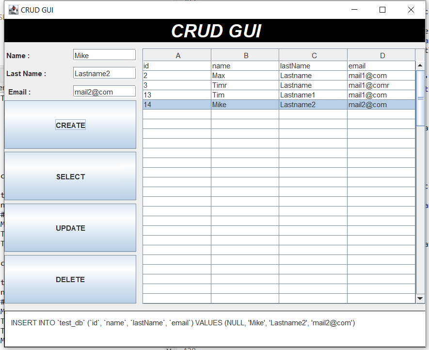

# GRUDgui

## Describtion and usage

With this programm you can manipulate a Sql Databese running on Xamp testserver with CRUD functinality.
(All changes will be shown in the JTable but will also synchronized)
  CREATE - READ(SELECT) - UPDATE - DELATE

<ul>
  <li>
    <strong>CREATE</strong> 
    To create a new item in the table you have to write name , lastName and email address in the corresponding textfiled.  
    Than you can click CREATE and the new item will be created.
   
  </li>
  
  <li>
  <strong>SELECT</strong> 
   The select button is used to select the items you want to update/delete from the table (will be marked blue). 
  </li>
  
  <li>
    <strong>UPDATE</strong> 
    To use update functionality you have to select a row in the Table first by using the select button.  
    Now you can update the textfields. Than you can click the UPDATE button and the corresponding line will be updated. 
  </li>
  
  <li>
    <strong>DELETE</strong> 
    To use delete functionality you heave to select a item first (Select button). 
    Than you can click the DELATE button to delete the selected line. 
  </li>
  
<ul>
 
  <bn>
 
  

